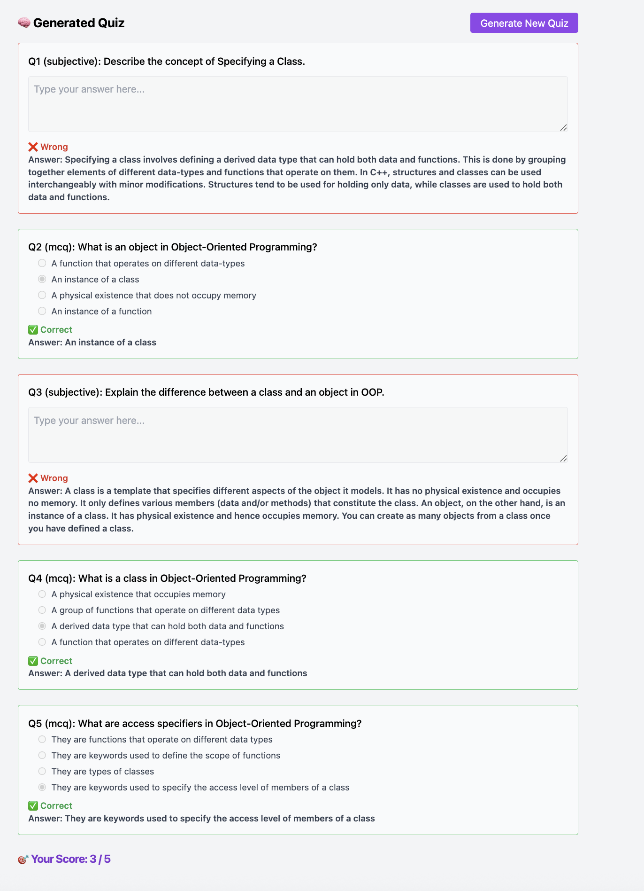

# 📚 AI Tutor – Smart Quiz Generator

This project is an AI-powered educational tool designed to convert PDF/Word study materials into intelligent chapter-wise quizzes. It detects chapters automatically, generates quizzes using an LLM, and evaluates answers.

## 🖼️ Screenshots

### 📘 Chapter Detection UI


### 🧠 Generated Quiz UI


---

## 💡 Summary

- Upload any textbook (PDF/Word)
- Automatically splits it into chapters (e.g., Unit 1, Unit 2…)
- Click "Generate Quiz" for any chapter to receive 5 AI-generated questions (MCQ/Subjective)
- Submit answers and receive automatic feedback and score

---

## 🚀 How to Run

### 📦 Prerequisites

- Python 3.10+
- Node.js 18+
- MySQL (local or Docker)
- OpenAI API key (or compatible LLM endpoint)
- Docker (for container-based deployment)

### 🛠️ Backend

```bash
cd backend
cp .env.example .env          # fill in DATABASE_URL, OPENAI_API_KEY, etc.
pip install -r requirements.txt
```

- Run all DDL scripts in `backend/ddl/` to create the required tables.
- If MySQL runs locally and the backend runs inside Docker, set `DB_HOST=host.docker.internal` in `.env` and create a shared network:

```bash
docker network create ai-network
docker-compose up --build
```

#### 🧪 Running Backend Tests

```bash
cd backend
pip install pytest pytest-asyncio httpx
pytest tests/ -v
```

### 🧑‍💻 Frontend

```bash
cd frontend
cp .env.example .env          # set VITE_API_BASE_URL=http://localhost:8000
npm install                   # or: yarn install
npm run dev                   # or: yarn dev
```

Open: [http://localhost:5173](http://localhost:5173)

#### 🧪 Running Frontend Tests

```bash
cd frontend
npm test
```

---

## ⚙️ Environment Variables

| File | Variable | Description |
|------|----------|-------------|
| `backend/.env` | `DATABASE_URL` | SQLAlchemy DB connection string |
| `backend/.env` | `OPENAI_API_KEY` | LLM API key |
| `backend/.env` | `OPENAI_BASE_URL` | LLM base URL (optional, for custom endpoints) |
| `backend/.env` | `CORS_ALLOWED_ORIGINS` | Comma-separated list of allowed frontend origins |
| `backend/.env` | `UPLOAD_DIR` | Directory for uploaded files (default: `uploads/`) |
| `frontend/.env` | `VITE_API_BASE_URL` | Backend API URL (e.g. `http://localhost:8000`) |

Copy the provided `.env.example` files to `.env` and fill in the values before running.

---

## 📄 License
MIT
